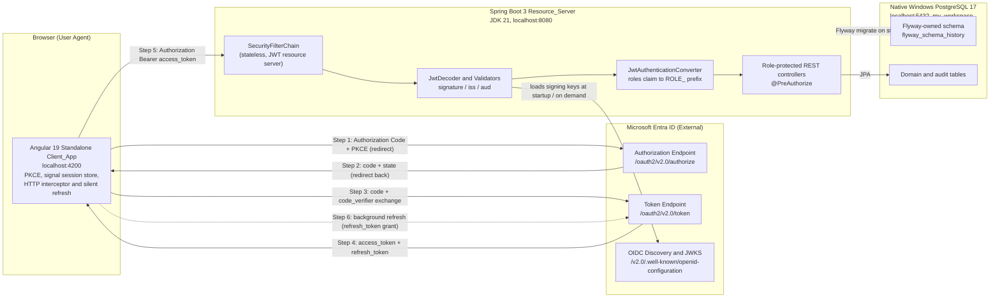
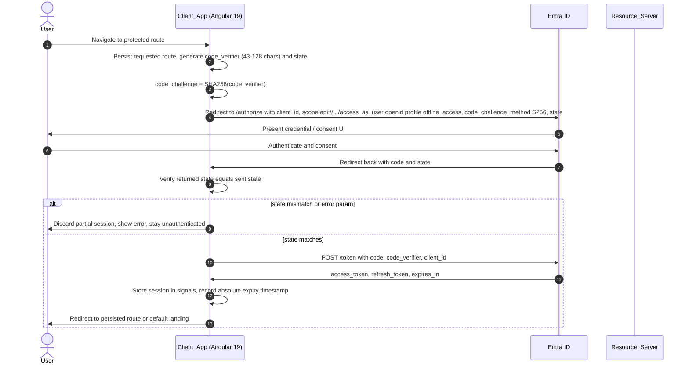
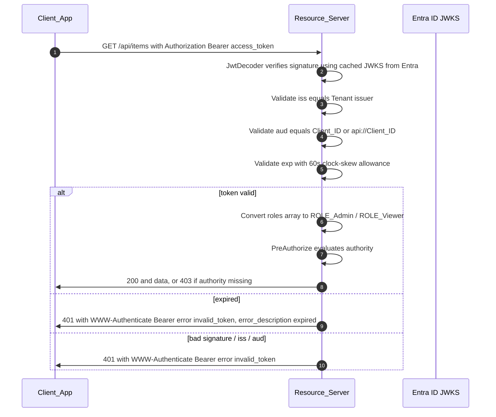
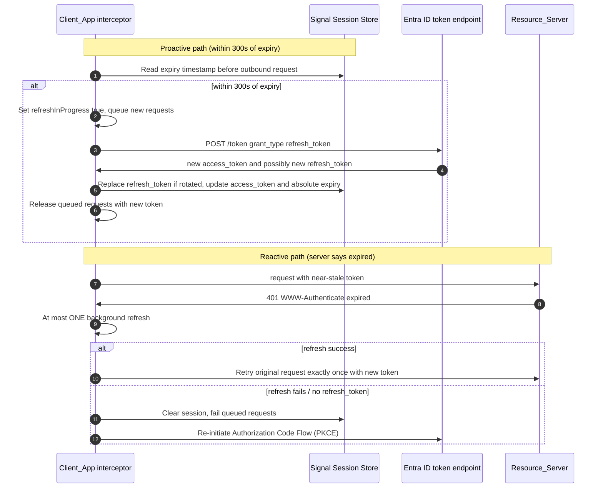

# Design Document

## Overview

This design describes a decoupled three-tier application secured by Microsoft Entra ID
using the OAuth2 Authorization Code Flow with PKCE (RFC 7636). The three tiers deploy and
run independently:

| Tier | Technology | Origin / Endpoint | Responsibility |
| --- | --- | --- | --- |
| Client_App | Angular 19 Standalone | `http://localhost:4200` | Interactive login, PKCE, signal session state, bearer API calls, silent refresh |
| Resource_Server | Spring Boot 3 / JDK 21 | `http://localhost:8080` | JWT validation, claim-to-authority mapping, role-protected REST endpoints |
| Database | PostgreSQL 17 (native Windows) | `localhost:5432` / `my_workspace` | Persistent domain data, Flyway-owned schema |

Microsoft Entra ID sits outside all three tiers as the OAuth2 Authorization Server and
OpenID Connect provider. It is the only party that issues tokens. The Client_App obtains
access and refresh tokens through interactive login, then refreshes access tokens silently
in the background. The Resource_Server never issues or refreshes tokens; it validates the
signature, issuer, and audience of each presented Access_Token and derives authorization
from the `roles` claim.

This design intentionally favors explicitness over brevity. The eventual implementation is
an **instructional reference**: every code artifact (security config, converter, interceptor,
guard, migration) will carry extensive inline comments explaining how the identity payload,
tokens, and data move down the stack, and the design includes a dedicated verification
strategy (jwt.io claim inspection, browser Network-tab refresh observation, server-side
authority confirmation). Task breakdown should preserve this instructional intent.

### Requirements Coverage Map

| Design Section | Requirements Satisfied |
| --- | --- |
| Architecture / Identity & Token Flow | R1, R3, R4 |
| Backend — SecurityFilterChain & JWT Decoder | R2, R3, R6, R8 |
| Backend — CORS | R5 |
| Backend — REST Controller | R8, R2 |
| Database / Flyway | R7 |
| Frontend — Bootstrap, MSAL, Guards | R1, R3, R4 |
| Frontend — HTTP Interceptor & Refresh | R3, R4 |
| Correctness Properties | R2, R3, R5, R6, R8, R4 |
| Verification Strategy | R2, R4, R6 |

## Architecture

### System Context and Token Flow



### Architectural Principles

1. **Stateless Resource Server.** The Resource_Server keeps no HTTP session. Every request
   is authenticated purely from the bearer Access_Token. This is enforced with
   `SessionCreationPolicy.STATELESS` and CSRF disabled (there is no cookie-based session to
   protect). *(R6, R8)*
2. **Token issuance is external.** Only Entra ID mints tokens. The Resource_Server trusts
   tokens transitively via signature + issuer + audience validation. *(R6)*
3. **Authorization derives from claims, not local role tables.** The `roles` claim is the
   single source of truth for authorization; the app-level user table is for audit/profile
   data only, never for access decisions. *(R2)*
4. **Schema is code.** The Database schema is owned entirely by Flyway migrations applied at
   Resource_Server startup, giving reproducible, checksum-validated, version-ordered
   evolution. *(R7)*
5. **Silent session continuity.** The Client_App refreshes tokens proactively (before expiry)
   and reactively (on 401), queuing concurrent requests during a single refresh. *(R3, R4)*

## Identity & Token Flow

### Identity Configuration (authoritative constants)

These values are fixed for this deployment and are referenced by both tiers:

| Setting | Value |
| --- | --- |
| Tenant_ID | `76325907-a5db-46b1-9d5a-cbcca2e63e66` |
| Client_ID | `4ebf7ee5-2120-4d4a-8c31-63642bb9fc9c` |
| API_Scope | `api://4ebf7ee5-2120-4d4a-8c31-63642bb9fc9c/access_as_user` |
| Authority | `https://login.microsoftonline.com/76325907-a5db-46b1-9d5a-cbcca2e63e66/v2.0` |
| Issuer (iss) | `https://login.microsoftonline.com/76325907-a5db-46b1-9d5a-cbcca2e63e66/v2.0` |
| JWKS / discovery | `https://login.microsoftonline.com/76325907-a5db-46b1-9d5a-cbcca2e63e66/v2.0/.well-known/openid-configuration` |
| Accepted audiences | `4ebf7ee5-2120-4d4a-8c31-63642bb9fc9c` **or** `api://4ebf7ee5-2120-4d4a-8c31-63642bb9fc9c` |
| Redirect URI | `http://localhost:4200` |
| Requested scopes | `api://.../access_as_user`, `openid`, `profile`, `offline_access` |

### Login: Authorization Code Flow with PKCE



*(Login sequence satisfies R1.1-R1.10.)*

### Authenticated API Call (bearer token)



*(API call path satisfies R3.1, R3.2, R6.3-R6.8, R8.)*

### Silent Background Refresh



*(Refresh sequences satisfy R3.3-R3.6, R4.1-R4.7.)*

## Components and Interfaces

### Backend (Spring Boot 3 / JDK 21)

#### Maven Dependencies

```xml
<!-- pom.xml (excerpt) -->
<properties>
    <java.version>21</java.version>
    <flyway.version>10.20.1</flyway.version> <!-- v10+ required for modular DB support -->
</properties>

<dependencies>
    <!-- Web / REST -->
    <dependency>
        <groupId>org.springframework.boot</groupId>
        <artifactId>spring-boot-starter-web</artifactId>
    </dependency>

    <!-- Security core + method security -->
    <dependency>
        <groupId>org.springframework.boot</groupId>
        <artifactId>spring-boot-starter-security</artifactId>
    </dependency>

    <!-- OAuth2 Resource Server: brings spring-security-oauth2-resource-server + oauth2-jose -->
    <dependency>
        <groupId>org.springframework.boot</groupId>
        <artifactId>spring-boot-starter-oauth2-resource-server</artifactId>
    </dependency>

    <!-- Persistence -->
    <dependency>
        <groupId>org.springframework.boot</groupId>
        <artifactId>spring-boot-starter-data-jpa</artifactId>
    </dependency>
    <dependency>
        <groupId>org.postgresql</groupId>
        <artifactId>postgresql</artifactId>
        <scope>runtime</scope>
    </dependency>

    <!-- Flyway core + PostgreSQL module (v10 split; module REQUIRED for PG 17) -->
    <dependency>
        <groupId>org.flywaydb</groupId>
        <artifactId>flyway-core</artifactId>
    </dependency>
    <dependency>
        <groupId>org.flywaydb</groupId>
        <artifactId>flyway-database-postgresql</artifactId>
    </dependency>

    <!-- Test -->
    <dependency>
        <groupId>org.springframework.boot</groupId>
        <artifactId>spring-boot-starter-test</artifactId>
        <scope>test</scope>
    </dependency>
    <dependency>
        <groupId>org.springframework.security</groupId>
        <artifactId>spring-security-test</artifactId>
        <scope>test</scope>
    </dependency>
    <!-- Property-based testing (jqwik) -->
    <dependency>
        <groupId>net.jqwik</groupId>
        <artifactId>jqwik</artifactId>
        <scope>test</scope>
    </dependency>
</dependencies>
```

> **Note on Flyway v10.** As of Flyway 10, database-specific support was split out of
> `flyway-core` into per-database modules. PostgreSQL support (including PostgreSQL 17)
> lives in `flyway-database-postgresql`; without it, startup fails with an "Unsupported
> Database / No database found to handle" error. Both dependencies are mandatory.
> ([Flyway modular v10 issue](https://github.com/flyway/flyway/issues/3780);
> [Red Gate PostgreSQL module docs](https://documentation.red-gate.com/fd/postgresql-database-277579325.html)).
> Content was rephrased for compliance with licensing restrictions.

#### SecurityFilterChain

A single `@Configuration` class with `@EnableMethodSecurity` provides the filter chain. It is
**stateless**, enables the OAuth2 resource server with JWT, wires the CORS source, and returns
401 for authentication failures and 403 for authorization failures.

```java
@Configuration
@EnableMethodSecurity // enables @PreAuthorize on controller methods (R8)
public class SecurityConfig {

    @Bean
    SecurityFilterChain filterChain(HttpSecurity http, CorsConfigurationSource cors,
                                    Converter<Jwt, AbstractAuthenticationToken> jwtConverter)
            throws Exception {
        http
            .cors(c -> c.configurationSource(cors))                 // R5
            .csrf(AbstractHttpConfigurer::disable)                  // stateless bearer API
            .sessionManagement(s -> s.sessionCreationPolicy(
                    SessionCreationPolicy.STATELESS))               // R6, R8
            .authorizeHttpRequests(auth -> auth
                .requestMatchers(HttpMethod.OPTIONS, "/**").permitAll() // preflight (R5.2)
                .requestMatchers("/actuator/health").permitAll()
                .anyRequest().authenticated())                      // R8.4
            .oauth2ResourceServer(oauth -> oauth
                .jwt(jwt -> jwt.jwtAuthenticationConverter(jwtConverter))); // R6
        // Default BearerTokenAuthenticationEntryPoint returns 401 + WWW-Authenticate (R3.2, R8.5)
        // Default BearerTokenAccessDeniedHandler returns 403 (R2.7, R8.3)
        return http.build();
    }
}
```

#### JWT Decoder, Issuer/Audience Validation, and Claim Conversion

Two concerns combine here:

1. **Decoding + validation** — `JwtDecoder` loads Entra signing keys from the OIDC discovery
   endpoint (from `issuer-uri`), verifies the signature, and runs a composite
   `OAuth2TokenValidator<Jwt>`:
   - `JwtValidators.createDefaultWithIssuer(issuer)` — validates `iss` and standard timing.
   - A **clock-skew** timestamp validator configured with a 60-second allowance (R3.1).
   - A custom **audience** validator accepting either the Client_ID or the `api://Client_ID`
     value (R6.4). Spring does not validate `aud` by default, so this is added explicitly.

   ```java
   @Bean
   JwtDecoder jwtDecoder(OAuth2ResourceServerProperties props,
                         @Value("${app.security.audiences}") List<String> audiences) {
       String issuer = props.getJwt().getIssuerUri();
       // Loads JWKS from Entra discovery at startup; failure surfaces a startup error (R6.1, R6.2)
       NimbusJwtDecoder decoder =
           JwtDecoders.fromIssuerLocation(issuer) instanceof NimbusJwtDecoder d ? d
               : NimbusJwtDecoder.withIssuerLocation(issuer).build();

       OAuth2TokenValidator<Jwt> withIssuer = JwtValidators.createDefaultWithIssuer(issuer); // iss (R6.5)
       OAuth2TokenValidator<Jwt> withClockSkew =
           new JwtTimestampValidator(Duration.ofSeconds(60)); // exp + 60s skew (R3.1)
       OAuth2TokenValidator<Jwt> withAudience = new AudienceValidator(audiences); // aud (R6.4)
       decoder.setJwtValidator(new DelegatingOAuth2TokenValidator<>(
               withIssuer, withClockSkew, withAudience));
       return decoder;
   }
   ```

   `AudienceValidator` returns `OAuth2Error("invalid_token")` when `aud` contains none of the
   accepted values; the framework maps that to **401** with a `WWW-Authenticate` header
   (R6.8, R8.5). Signature-verification failure similarly yields **401** (R6.7).

2. **Roles claim -> authorities** — a `JwtAuthenticationConverter` wraps a custom
   `Converter<Jwt, Collection<GrantedAuthority>>` that reads the `roles` claim (a JSON array
   of strings), maps each distinct value to `new SimpleGrantedAuthority("ROLE_" + value)`
   preserving case, and defends against malformed input.

   ```java
   final class RolesClaimConverter implements Converter<Jwt, Collection<GrantedAuthority>> {
       @Override
       public Collection<GrantedAuthority> convert(Jwt jwt) {
           Object claim = jwt.getClaim("roles");
           if (!(claim instanceof Collection<?> raw)) {
               return List.of(); // absent OR not an array -> zero authorities (R2.5, R2.6)
           }
           return raw.stream()
               .filter(String.class::isInstance).map(String.class::cast) // non-strings ignored (R2.6)
               .distinct()                                                // distinct values (R2.2)
               .map(role -> new SimpleGrantedAuthority("ROLE_" + role))   // ROLE_ prefix, case-sensitive (R2.2-R2.4)
               .collect(Collectors.toUnmodifiableList());
       }
   }

   @Bean
   Converter<Jwt, AbstractAuthenticationToken> jwtAuthenticationConverter() {
       JwtAuthenticationConverter c = new JwtAuthenticationConverter();
       c.setJwtGrantedAuthoritiesConverter(new RolesClaimConverter());
       return c;
   }
   ```

#### CORS Configuration

A `CorsConfigurationSource` bean encodes the required policy. It is registered with the filter
chain (above) so preflight and actual responses both carry the correct headers.

```java
@Bean
CorsConfigurationSource corsConfigurationSource() {
    CorsConfiguration cfg = new CorsConfiguration();
    cfg.setAllowedOrigins(List.of("http://localhost:4200"));                 // R5.1, R5.6
    cfg.setAllowedMethods(List.of("GET", "POST", "PUT", "DELETE", "OPTIONS"));// R5.3
    cfg.setAllowedHeaders(List.of("Authorization", "Content-Type"));         // R5.4
    cfg.setAllowCredentials(true);                                           // R5.5
    UrlBasedCorsConfigurationSource source = new UrlBasedCorsConfigurationSource();
    source.registerCorsConfiguration("/**", cfg);
    return source;
}
```

Because a single explicit origin is configured (not `*`), requests from other origins receive
no `Access-Control-Allow-Origin` header, so the browser blocks them (R5.6). Preflight `OPTIONS`
is permitted in the filter chain and answered 200 by Spring's CORS filter (R5.2).

#### Role-Protected REST Controller

A controller exposing a sample domain resource (`items`) demonstrates read/write role split
with method security. Read requires `ROLE_Viewer` (or `ROLE_Admin`); write requires
`ROLE_Admin`.

```java
@RestController
@RequestMapping("/api/items")
class ItemController {
    private final ItemService service;
    ItemController(ItemService service) { this.service = service; }

    @GetMapping                                   // read endpoint
    @PreAuthorize("hasAnyRole('Viewer','Admin')") // ROLE_Viewer or ROLE_Admin (R8.1)
    List<ItemDto> list() { return service.findAll(); }

    @PostMapping                                  // write endpoint
    @PreAuthorize("hasRole('Admin')")             // ROLE_Admin only (R8.2); Viewer -> 403 (R8.3)
    ResponseEntity<ItemDto> create(@RequestBody @Valid CreateItemRequest req) {
        ItemDto created = service.create(req);
        return ResponseEntity.status(HttpStatus.CREATED).body(created); // 201 (R8.2)
    }

    @PutMapping("/{id}")
    @PreAuthorize("hasRole('Admin')")             // write -> Admin only (R8.2, R8.3)
    ItemDto update(@PathVariable long id, @RequestBody @Valid UpdateItemRequest req) {
        return service.update(id, req);
    }
}
```

`hasRole('Admin')` implicitly checks the `ROLE_Admin` authority, matching the converter's
prefixing scheme. Missing authority yields 403 without mutating data (R8.3); a missing/invalid
token is stopped earlier in the chain with 401 (R8.4, R8.5).

#### application.yml

```yaml
server:
  port: 8080

spring:
  security:
    oauth2:
      resourceserver:
        jwt:
          # OIDC discovery endpoint derives jwk-set-uri automatically (R6.1)
          issuer-uri: https://login.microsoftonline.com/76325907-a5db-46b1-9d5a-cbcca2e63e66/v2.0
          # Optional explicit override:
          # jwk-set-uri: https://login.microsoftonline.com/76325907-a5db-46b1-9d5a-cbcca2e63e66/discovery/v2.0/keys
  datasource:
    url: jdbc:postgresql://localhost:5432/my_workspace
    username: postgres
    password: postgres
    hikari:
      connection-timeout: 10000   # 10s connect budget (R7.1, R7.2)
  jpa:
    hibernate:
      ddl-auto: validate          # schema owned by Flyway, never by Hibernate (R7)
    open-in-view: false
  flyway:
    enabled: true
    locations: classpath:db/migration
    baseline-on-migrate: false
    validate-on-migrate: true     # checksum validation halts on drift (R7.6)

app:
  security:
    # Accept either the app (client) id or the api:// identifier URI as audience (R6.4)
    audiences:
      - 4ebf7ee5-2120-4d4a-8c31-63642bb9fc9c
      - api://4ebf7ee5-2120-4d4a-8c31-63642bb9fc9c
```

### Database / Flyway Design

#### Migration Strategy on Native PostgreSQL 17 (no Docker)

- Flyway runs automatically at Resource_Server startup (Spring Boot auto-configuration),
  connecting to the native Windows PostgreSQL 17 instance at `localhost:5432/my_workspace`
  as user `postgres`, within a 10-second connection budget (R7.1). Failure to connect halts
  startup with a connection error (R7.2).
- **Module requirement:** Flyway v10 split database support into modules. `flyway-core` alone
  cannot handle PostgreSQL 17; `flyway-database-postgresql` (v10+) must be on the classpath
  (R7.8).
- On each start, Flyway scans `classpath:db/migration`, computes the set of pending migrations,
  and applies them in **ascending version order** (R7.3). Each applied migration is recorded in
  `flyway_schema_history` with its version, description, checksum, and success flag (R7.4).
  Already-recorded migrations are skipped on subsequent starts (R7.5).
- **Checksum validation:** with `validate-on-migrate: true`, if the checksum of an
  already-applied migration file differs from the recorded checksum, Flyway halts startup with
  a validation error and leaves the schema unchanged (R7.6).
- **Failure handling:** if a migration fails to apply, Flyway halts startup and reports which
  migration failed. On PostgreSQL (transactional DDL), the failed migration's statements are
  rolled back within its transaction (R7.7).

#### `flyway_schema_history` behavior

Flyway creates and maintains this table automatically in `my_workspace`. Each row is an applied
migration keyed by an ascending `installed_rank`, storing `version`, `description`, `checksum`,
`installed_on`, `execution_time`, and `success`. This table is the authoritative ledger that
drives skip/validate/halt behavior above.

#### Initial migration — `V1__initial_schema.sql`

Naming follows `V<version>__<description>.sql` (R7.9). The initial migration defines a sample
domain table (`item`) plus an app-level user/audit table. The audit table records identity
subjects seen in tokens for traceability; it is **not** used for authorization (authorization
is claim-driven per R2).

```sql
-- V1__initial_schema.sql
-- Owned by Flyway. Applied at Resource_Server startup, recorded in flyway_schema_history.

-- Sample domain table exercised by the role-protected REST endpoints (R8).
CREATE TABLE item (
    id           BIGSERIAL PRIMARY KEY,
    name         VARCHAR(200) NOT NULL,
    description  TEXT,
    created_by   VARCHAR(100) NOT NULL,      -- subject (oid/sub) from the Access_Token
    created_at   TIMESTAMPTZ NOT NULL DEFAULT now(),
    updated_at   TIMESTAMPTZ NOT NULL DEFAULT now()
);

-- App-level user/profile record derived from token claims (audit/profile only, NOT authz).
CREATE TABLE app_user (
    id            BIGSERIAL PRIMARY KEY,
    subject       VARCHAR(100) NOT NULL UNIQUE, -- Entra oid/sub claim
    display_name  VARCHAR(200),
    first_seen_at TIMESTAMPTZ NOT NULL DEFAULT now(),
    last_seen_at  TIMESTAMPTZ NOT NULL DEFAULT now()
);

-- Audit trail of security-relevant actions, for the instructional verification story (R2, R8).
CREATE TABLE access_audit (
    id           BIGSERIAL PRIMARY KEY,
    subject      VARCHAR(100) NOT NULL,
    authorities  TEXT NOT NULL,             -- serialized ROLE_* granted for the request
    http_method  VARCHAR(10) NOT NULL,
    path         VARCHAR(300) NOT NULL,
    status       INTEGER NOT NULL,
    occurred_at  TIMESTAMPTZ NOT NULL DEFAULT now()
);

CREATE INDEX idx_item_created_by ON item(created_by);
CREATE INDEX idx_access_audit_subject ON access_audit(subject);
```

### Frontend (Angular 19 Standalone)

#### Standalone Bootstrap and Providers

The application boots with `bootstrapApplication` and an `app.config.ts` that assembles
providers: router (with guards), HTTP client with the auth interceptor, and MSAL providers for
the Authorization Code Flow + PKCE.

```typescript
// main.ts
bootstrapApplication(AppComponent, appConfig)
  .catch(err => console.error(err));
```

```typescript
// app.config.ts
export const appConfig: ApplicationConfig = {
  providers: [
    provideRouter(routes),
    provideHttpClient(withInterceptors([authTokenInterceptor])), // functional interceptor
    // MSAL (uses Authorization Code Flow with PKCE under the hood)
    { provide: MSAL_INSTANCE, useFactory: msalInstanceFactory },
    { provide: MSAL_GUARD_CONFIG, useFactory: msalGuardConfigFactory },
    { provide: MSAL_INTERCEPTOR_CONFIG, useFactory: msalInterceptorConfigFactory },
    MsalService, MsalGuard, MsalBroadcastService,
  ],
};
```

```typescript
// auth/msal.config.ts — identity constants (R1.3)
export const TENANT_ID = '76325907-a5db-46b1-9d5a-cbcca2e63e66';
export const CLIENT_ID = '4ebf7ee5-2120-4d4a-8c31-63642bb9fc9c';
export const API_SCOPE = `api://${CLIENT_ID}/access_as_user`;
export const AUTHORITY = `https://login.microsoftonline.com/${TENANT_ID}/v2.0`;

export function msalInstanceFactory(): IPublicClientApplication {
  return new PublicClientApplication({
    auth: {
      clientId: CLIENT_ID,
      authority: AUTHORITY,
      redirectUri: 'http://localhost:4200',      // R1 redirect target
      navigateToLoginRequestUrl: true,           // return to originally requested route (R1.7)
    },
    cache: {
      // Refresh tokens are held by MSAL in browser storage scoped to this origin (R4.7).
      cacheLocation: 'localStorage',
    },
  });
}
```

> **Design note on refresh control.** MSAL's default `MsalInterceptor` and `acquireTokenSilent`
> already implement PKCE, refresh-token rotation, and same-origin token storage. However,
> Requirement 3/4 demand *specific, observable* behaviors — a single reactive refresh on 401,
> proactive refresh within a 300s / 60s threshold, explicit request queuing, and bounded
> transient retries. To make these behaviors explicit and testable (and to support the
> instructional/verification goals), this design uses a **thin custom `AuthTokenInterceptor`
> and `AuthSessionStore`** layered over MSAL's `acquireTokenSilent`/`acquireTokenRedirect`
> primitives rather than relying solely on the opaque default interceptor.

#### Signal-based Session Store

```typescript
// auth/auth-session.store.ts
export interface SessionState {
  authenticated: boolean;
  accessToken: string | null;
  expiresAt: number | null; // absolute epoch ms (R4.3)
  roles: string[];
}

@Injectable({ providedIn: 'root' })
export class AuthSessionStore {
  private readonly _state = signal<SessionState>({
    authenticated: false, accessToken: null, expiresAt: null, roles: [],
  });
  readonly state = this._state.asReadonly();
  readonly isAuthenticated = computed(() => this._state().authenticated); // R1.5

  setSession(token: string, expiresAt: number, roles: string[]): void {   // R4.3
    this._state.set({ authenticated: true, accessToken: token, expiresAt, roles });
  }
  clear(): void {                                                          // R3.5, R4.5
    this._state.set({ authenticated: false, accessToken: null, expiresAt: null, roles: [] });
  }
  needsProactiveRefresh(now = Date.now()): boolean {                       // R3.4, R4.1
    const exp = this._state().expiresAt;
    return exp != null && exp - now <= 300_000; // within 300s of expiry
  }
}
```

#### HTTP Interceptor (bearer attach + refresh + queuing)

A functional interceptor that: attaches the bearer token, proactively refreshes when within
threshold, handles 401 with a single background refresh, queues concurrent requests during a
refresh, and retries the original request once on success.

```typescript
// auth/auth-token.interceptor.ts
export const authTokenInterceptor: HttpInterceptorFn = (req, next) => {
  const store = inject(AuthSessionStore);   // signal store (inject() DI, R? modern conv.)
  const refresher = inject(TokenRefreshService);

  // Proactive refresh when within 300s/60s of expiry BEFORE issuing the request (R3.4, R4.1)
  const preflight$ = store.needsProactiveRefresh()
    ? refresher.refresh()  // shared, single-flight; queues concurrent callers (R4.4)
    : of(void 0);

  return preflight$.pipe(
    switchMap(() => next(withBearer(req, store.state().accessToken))),
    catchError((err: HttpErrorResponse) => {
      // Reactive path: server reported expired token (R3.3)
      if (err.status === 401 && isExpiredChallenge(err)) {
        return refresher.refresh().pipe(              // at most ONE background refresh (R3.3)
          switchMap(() => next(withBearer(req, store.state().accessToken))), // retry once (R3.6)
          catchError(refreshErr => {                  // refresh failed / no refresh token (R3.5, R4.5)
            store.clear();
            refresher.beginInteractiveLogin();        // re-initiate Auth Code + PKCE (R4.5)
            return throwError(() => refreshErr);
          }),
        );
      }
      return throwError(() => err);
    }),
  );
};
```

```typescript
// auth/token-refresh.service.ts — single-flight refresh with queuing + transient retry
@Injectable({ providedIn: 'root' })
export class TokenRefreshService {
  private readonly msal = inject(MsalService);
  private readonly store = inject(AuthSessionStore);
  private inFlight$: Observable<void> | null = null; // ensures single refresh (R4.4)

  refresh(): Observable<void> {
    if (this.inFlight$) return this.inFlight$;        // queue concurrent callers (R4.4)
    this.inFlight$ = from(this.msal.instance.acquireTokenSilent({
        scopes: [API_SCOPE],                          // refresh_token grant behind MSAL
      })).pipe(
        // Bounded transient retry: 3 attempts, increasing delay (R4.6)
        retry({ count: 3, delay: (_e, i) => timer(500 * Math.pow(2, i)), resetOnSuccess: true }),
        map(result => {
          // Rotated refresh token is persisted internally by MSAL (R4.2, R4.7)
          this.store.setSession(result.accessToken,
              result.expiresOn!.getTime(),            // absolute expiry timestamp (R4.3)
              (result.idTokenClaims as any)?.roles ?? []);
        }),
        catchError(err => {
          this.store.clear();                         // invalid_grant / expired refresh (R4.5)
          this.beginInteractiveLogin();
          return throwError(() => err);
        }),
        finalize(() => { this.inFlight$ = null; }),    // release single-flight latch
        shareReplay(1),
      );
    return this.inFlight$;
  }

  beginInteractiveLogin(): void {
    this.msal.instance.acquireTokenRedirect({ scopes: [API_SCOPE], redirectStartPage: location.href });
  }
}
```

#### Routing and Role Guard

```typescript
// app.routes.ts
export const routes: Routes = [
  { path: 'login', component: LoginComponent },
  {
    path: 'dashboard',
    component: DashboardComponent,
    canActivate: [authGuard],                     // triggers login if unauthenticated (R1.1)
  },
  {
    path: 'admin',
    component: AdminComponent,
    canActivate: [authGuard, roleGuard(['Admin'])], // enforce role (R8 client-side gate)
  },
  { path: '', redirectTo: 'dashboard', pathMatch: 'full' }, // default landing (R1.8)
];
```

```typescript
// auth/auth.guard.ts
export const authGuard: CanActivateFn = (route, state) => {
  const store = inject(AuthSessionStore);
  const refresher = inject(TokenRefreshService);
  if (store.isAuthenticated()) return true;
  sessionStorage.setItem('postLoginRedirect', state.url); // persist requested route (R1.1, R1.7)
  refresher.beginInteractiveLogin();                      // initiate Auth Code + PKCE (R1.1)
  return false;
};

export function roleGuard(required: string[]): CanActivateFn {
  return () => {
    const store = inject(AuthSessionStore);
    const roles = store.state().roles;
    return required.some(r => roles.includes(r)); // client-side role gate; server is authoritative
  };
}
```

## Data Models

### Backend domain / DTOs (JPA)

```java
@Entity @Table(name = "item")
class Item {
    @Id @GeneratedValue(strategy = GenerationType.IDENTITY) Long id;
    @Column(nullable = false) String name;
    @Column String description;
    @Column(name = "created_by", nullable = false) String createdBy; // token subject
    @Column(name = "created_at", nullable = false) OffsetDateTime createdAt;
    @Column(name = "updated_at", nullable = false) OffsetDateTime updatedAt;
}

record ItemDto(Long id, String name, String description, String createdBy) {}
record CreateItemRequest(@NotBlank String name, String description) {}
record UpdateItemRequest(@NotBlank String name, String description) {}
```

### Token claim model (validated, read-only view)

| Claim | Purpose | Validation |
| --- | --- | --- |
| `iss` | Issuer identity | Must equal tenant issuer (R6.5) |
| `aud` | Intended audience | Must equal Client_ID or `api://Client_ID` (R6.4) |
| `exp` | Expiry | Now must be < exp + 60s skew (R3.1) |
| `roles` | Authorization roles | Array of strings -> `ROLE_*` authorities (R2) |
| `sub` / `oid` | Subject | Persisted for audit (`created_by`, `app_user.subject`) |

### Frontend session model

`SessionState` (above): `{ authenticated, accessToken, expiresAt (absolute epoch ms), roles }`,
held in a signal and mutated only through `AuthSessionStore` (R1.5, R4.3).
## Correctness Properties

*A property is a characteristic or behavior that should hold true across all valid executions
of a system — a formal statement about what the system should do. The properties below are
written to be **executable** as property-based tests: backend properties target
[jqwik](https://jqwik.net); frontend properties target
[fast-check](https://fast-check.dev). Each property names its generated inputs, the invariant
or oracle to assert, and the requirement(s) it validates. Property-based tests run a minimum of
100 generated cases per property.*

### Property 1: Role claim maps to exactly the prefixed distinct set

*For any* `roles` claim that is an array of arbitrary strings, the authorities produced by
`RolesClaimConverter` equal exactly the set `{ "ROLE_" + r }` over the **distinct** raw values,
with original case preserved. *For any* input where the `roles` claim is absent or is not a JSON
array (string, number, object, null), the resulting authority set is empty.

**Validates: Requirements 2.2, 2.3, 2.4, 2.5, 2.6**

```java
// jqwik — backend
// Feature: entra-oauth-fullstack, Property 1: Role claim maps to exactly the prefixed distinct set
// Validates: Requirements R2 (R2.2, R2.3, R2.4, R2.5, R2.6)
@Property(tries = 100)
void rolesMapToPrefixedDistinctAuthorities(@ForAll List<@AlphaChars @StringLength(min = 1, max = 20) String> roles) {
    // Build a Jwt whose "roles" claim is the generated array.
    Jwt jwt = jwtWithRolesClaim(roles);

    Collection<GrantedAuthority> authorities = new RolesClaimConverter().convert(jwt);

    // Oracle: the exact expected set is ROLE_ + each DISTINCT raw value, case preserved.
    Set<String> expected = roles.stream()
        .distinct()
        .map(r -> "ROLE_" + r)   // case-sensitive; no upper/lower normalization
        .collect(Collectors.toSet());
    Set<String> actual = authorities.stream()
        .map(GrantedAuthority::getAuthority)
        .collect(Collectors.toSet());

    assertThat(actual).isEqualTo(expected);
}

// Feature: entra-oauth-fullstack, Property 1 (cont.): non-array / absent roles -> empty authorities
// Validates: Requirements R2.5, R2.6
@Property(tries = 100)
void nonArrayOrAbsentRolesYieldEmptyAuthorities(@ForAll("nonArrayRolesClaims") Object claimValue) {
    // Generator "nonArrayRolesClaims" produces: null (absent), plain strings, numbers, maps — never a Collection.
    Jwt jwt = jwtWithRawRolesClaim(claimValue);
    assertThat(new RolesClaimConverter().convert(jwt)).isEmpty();
}
```

### Property 2: Invalid tokens are rejected with 401

*For any* token whose `exp` is earlier than `now − 60s` (i.e., outside the allowed clock skew),
the Resource_Server responds **401**. *For any* token whose `aud` is neither `Client_ID` nor
`api://Client_ID`, the response is **401**. *For any* token whose `iss` differs from the tenant
issuer, the response is **401**. *For any* token with a signature that does not verify against
the configured JWKS, the response is **401**. In every rejection case the response carries a
`WWW-Authenticate: Bearer error="invalid_token"` challenge.

**Validates: Requirements 3.1, 6.4, 6.5, 6.7, 6.8**

```java
// jqwik — backend, exercised through MockMvc / @WebMvcTest
// Feature: entra-oauth-fullstack, Property 2: Invalid tokens are rejected with 401
// Validates: Requirements R3.1, R6.4, R6.5, R6.7, R6.8
@Property(tries = 100)
void invalidTokensAreRejectedWith401(@ForAll("invalidTokens") TokenSpec spec) throws Exception {
    // Generator "invalidTokens" independently mutates ONE dimension into an invalid state:
    //   - expired: exp < now - 60s (past the skew window)          -> R3.1
    //   - badAudience: aud not in {Client_ID, api://Client_ID}      -> R6.4
    //   - badIssuer: iss != tenant issuer                           -> R6.5
    //   - badSignature: signed with a key absent from the JWKS      -> R6.7
    String bearer = buildToken(spec); // helper mints a JWS matching the mutation

    mockMvc.perform(get("/api/items").header("Authorization", "Bearer " + bearer))
        .andExpect(status().isUnauthorized())                               // 401 (R6.8)
        .andExpect(header().string("WWW-Authenticate", containsString("invalid_token"))); // R8.5
}
```

### Property 3: CORS headers honor only the allowed origin

*For any* request carrying `Origin: http://localhost:4200`, the response includes
`Access-Control-Allow-Origin: http://localhost:4200` and
`Access-Control-Allow-Credentials: true`. *For any* other origin, the response contains **no**
`Access-Control-Allow-Origin` header (the browser therefore blocks the response).

**Validates: Requirements 5.1, 5.5, 5.6**

```java
// jqwik — backend, exercised through MockMvc
// Feature: entra-oauth-fullstack, Property 3: CORS headers honor only the allowed origin
// Validates: Requirements R5 (R5.1, R5.5, R5.6)
@Property(tries = 100)
void corsReflectsOnlyAllowedOrigin(@ForAll("origins") String origin) throws Exception {
    // Generator "origins" mixes the single allowed origin with arbitrary other schemes/hosts/ports.
    var result = mockMvc.perform(options("/api/items")
            .header("Origin", origin)
            .header("Access-Control-Request-Method", "GET"))
        .andReturn().getResponse();

    if (origin.equals("http://localhost:4200")) {
        assertThat(result.getHeader("Access-Control-Allow-Origin")).isEqualTo("http://localhost:4200");
        assertThat(result.getHeader("Access-Control-Allow-Credentials")).isEqualTo("true");
    } else {
        // No ACAO header for disallowed origins -> browser blocks (R5.6).
        assertThat(result.getHeader("Access-Control-Allow-Origin")).isNull();
    }
}
```

### Property 4: Write endpoints require ROLE_Admin

*For any* request to a write endpoint (`POST`/`PUT`) whose granted authorities do **not** include
`ROLE_Admin`, the Resource_Server responds **403** and performs **no** data mutation. *For any*
such request whose authorities include `ROLE_Admin`, the response is a success status
(**200**/**201**) and the mutation is applied.

**Validates: Requirements 8.2, 8.3**

```java
// jqwik — backend, MockMvc + spring-security-test jwt() post-processor
// Feature: entra-oauth-fullstack, Property 4: Write endpoints require ROLE_Admin
// Validates: Requirements R8.2, R8.3
@Property(tries = 100)
void writeEndpointsRequireAdmin(@ForAll("authoritySets") Set<String> roles) throws Exception {
    // Generator "authoritySets" yields arbitrary subsets of {Admin, Viewer, <random roles>}.
    boolean isAdmin = roles.contains("Admin");
    long before = itemRepository.count();

    var authorities = roles.stream()
        .map(r -> new SimpleGrantedAuthority("ROLE_" + r))
        .toList();

    var response = mockMvc.perform(post("/api/items")
            .with(jwt().authorities(authorities))                 // simulate converted authorities
            .contentType(MediaType.APPLICATION_JSON)
            .content("{\"name\":\"x\"}"))
        .andReturn().getResponse();

    long after = itemRepository.count();
    if (isAdmin) {
        assertThat(response.getStatus()).isIn(200, 201);          // R8.2
        assertThat(after).isEqualTo(before + 1);                  // mutation applied
    } else {
        assertThat(response.getStatus()).isEqualTo(403);          // R8.3
        assertThat(after).isEqualTo(before);                      // NO mutation
    }
}
```

### Property 5: Refresh is single-flight and rotates the stored token

*For any* number `N ≥ 1` of concurrent requests that trigger a refresh while one refresh is
already in flight, `TokenRefreshService` makes **exactly one** token-endpoint call, and all `N`
callers observe the **same** resulting access token. *For any* refresh whose response returns a
rotated refresh token, the stored refresh token is **replaced** by the rotated value.

**Validates: Requirements 4.2, 4.4**

```typescript
// fast-check — frontend
// Feature: entra-oauth-fullstack, Property 5: Refresh is single-flight and rotates the stored token
// Validates: Requirements R4.2, R4.4
it('coalesces concurrent refreshes into one token call and rotates the refresh token', () => {
  fc.assert(fc.property(
    fc.integer({ min: 1, max: 50 }),      // N concurrent callers
    fc.string({ minLength: 10 }),         // new access token
    fc.option(fc.string({ minLength: 10 }), { nil: undefined }), // possibly-rotated refresh token
    (n, newAccess, rotatedRefresh) => {
      const { service, store, tokenEndpointSpy } = makeRefreshHarness(newAccess, rotatedRefresh);

      // Fire N concurrent refreshes against the single-flight service.
      const results = Array.from({ length: n }, () => service.refresh());

      flushAsync();

      // Exactly ONE token-endpoint call regardless of N (single-flight latch, R4.4).
      expect(tokenEndpointSpy).toHaveBeenCalledTimes(1);
      // All callers observe the SAME new access token.
      expect(store.state().accessToken).toBe(newAccess);
      results.forEach(r => expect(observedToken(r)).toBe(newAccess));
      // Rotation: when a new refresh token is returned it replaces the stored one (R4.2).
      if (rotatedRefresh !== undefined) {
        expect(storedRefreshToken(store)).toBe(rotatedRefresh);
      }
    },
  ), { numRuns: 100 });
});
```

### Property 6: Transient refresh failures are retried at most three times, then re-auth

*For any* sequence of transient refresh failures, `TokenRefreshService` performs **at most 3**
retry attempts. If the 3rd retry also fails, the session is cleared and interactive login is
initiated exactly once.

**Validates: Requirements 4.6**

```typescript
// fast-check — frontend
// Feature: entra-oauth-fullstack, Property 6: Transient refresh failures retried <= 3 then re-auth
// Validates: Requirements R4.6
it('retries transient failures at most 3 times then clears session and re-authenticates', () => {
  fc.assert(fc.property(
    fc.integer({ min: 0, max: 6 }),   // number of leading transient failures before a (possible) success
    (failuresBeforeSuccess) => {
      const { service, store, attemptSpy, beginLoginSpy } =
        makeRetryHarness({ failuresBeforeSuccess });

      let succeeded = false;
      service.refresh().subscribe({ next: () => (succeeded = true), error: () => {} });
      flushAsync();

      // At most 3 RETRIES after the initial attempt => at most 4 total attempts.
      expect(attemptSpy.mock.calls.length).toBeLessThanOrEqual(4);

      if (failuresBeforeSuccess <= 3) {
        // Recovered within the retry budget: session set, no re-auth.
        expect(succeeded).toBe(true);
        expect(beginLoginSpy).not.toHaveBeenCalled();
      } else {
        // Exhausted budget: session cleared and interactive login started exactly once (R4.6).
        expect(store.state().authenticated).toBe(false);
        expect(beginLoginSpy).toHaveBeenCalledTimes(1);
      }
    },
  ), { numRuns: 100 });
});
```

## Error Handling

Errors are handled at three tiers: **startup** (fail fast so a misconfigured server never
serves traffic), **request-time** (uniform 401/403 semantics on the Resource_Server), and
**client-side** (the Client_App degrades to re-authentication rather than a broken session). The
matrix below enumerates each condition, its tier, the response or behavior, and the requirement
it satisfies.

| Condition | Tier | Response / Behavior | Requirement |
| --- | --- | --- | --- |
| JWKS / OIDC discovery endpoint unreachable at startup | Startup | Resource_Server fails to start; JWKS load error surfaced | R6.2 |
| Database unreachable within 10s connection budget | Startup | Startup halts with a connection error; no traffic served | R7.2 |
| Migration checksum drift (applied file changed) | Startup | `validate-on-migrate` halts startup; schema left unchanged | R7.6 |
| Migration fails to apply | Startup | Startup halts, failing migration reported; DDL rolled back in its transaction | R7.7 |
| Access_Token expired (beyond 60s skew) | Request | **401** + `WWW-Authenticate: Bearer error="invalid_token", error_description="...expired..."` | R3.2, R8.5 |
| Bad signature / wrong `aud` / wrong `iss` | Request | **401** + `WWW-Authenticate: Bearer error="invalid_token"` | R6.7, R6.8 |
| Authenticated but missing required authority | Request | **403**; no data mutation | R2.7, R8.3 |
| No bearer token on a protected endpoint | Request | **401** (authentication entry point) | R8.4 |
| Token exchange (code -> token) fails | Client | Session not established; error surfaced; user stays unauthenticated | R1.6 |
| Returned `state` does not match sent `state` | Client | Partial session discarded; error shown; stay unauthenticated | R1.9 |
| Authorization response carries an `error` param | Client | Redirect handled as failure; no session established | R1.10 |
| Refresh fails or no refresh token available | Client | Session cleared; re-initiate Authorization Code Flow (PKCE) | R3.5, R4.5 |

**Startup tier.** All fatal configuration and infrastructure problems (JWKS unreachable,
database unreachable, checksum drift, migration failure) abort application startup rather than
degrade at runtime. This guarantees that a running Resource_Server has valid signing keys and a
schema that matches its migrations.

**Request tier.** The Resource_Server keeps a strict split between **authentication** failures
(**401**, via the default `BearerTokenAuthenticationEntryPoint`, always with a
`WWW-Authenticate` challenge) and **authorization** failures (**403**, via the default
`BearerTokenAccessDeniedHandler`). A 403 never mutates data because `@PreAuthorize` runs before
the controller body executes.

**Client tier.** The Client_App treats every unrecoverable token problem as a transition back to
interactive login: `AuthSessionStore.clear()` resets signal state and `TokenRefreshService`
begins the Authorization Code Flow with PKCE. Login-time failures (token exchange error, `state`
mismatch, authorization `error` parameter) never leave a partially authenticated session.

## Testing Strategy

Verification combines automated tests with three explicit, instructional manual checks that let
a learner *observe* the identity payload and refresh machinery directly. The manual steps are
part of the deliverable's instructional intent, not a substitute for the automated suite.

### 1. Automated tests

- **Unit + property tests.** Backend properties run under **jqwik**; frontend properties run
  under **fast-check** (Properties 1–6 above, minimum 100 generated cases each). Unit tests
  cover concrete examples and edge cases that complement the universal properties.
- **Backend security slice.** Use Spring's `@WebMvcTest` with `MockMvc`. Present tokens with the
  `spring-security-test` `jwt()` request post-processor (e.g.,
  `.with(jwt().authorities(new SimpleGrantedAuthority("ROLE_Admin")))`) to assert role/status
  behavior: `ROLE_Viewer` → 200 on read / 403 on write, `ROLE_Admin` → 200/201 on write,
  anonymous → 401. Invalid-token cases (expired, bad `aud`/`iss`/signature) assert **401** with
  the `WWW-Authenticate` challenge (R3.1, R6.4, R6.5, R6.7, R6.8, R8.2–R8.5).
- **Frontend interceptor tests.** Use Angular's `HttpTestingController` to drive
  `authTokenInterceptor`: assert the bearer header is attached, that a proactive refresh fires
  within the expiry threshold, that a single reactive refresh occurs on a 401 expired challenge
  with exactly one retry of the original request, that concurrent requests queue behind one
  in-flight refresh, and that transient failures retry at most three times before clearing the
  session (R3.3–R3.6, R4.1–R4.6).

### 2. Manual claim inspection with jwt.io

1. Open the Client_App in the browser and sign in so a session is established.
2. Capture the encoded Access_Token one of two ways:
   - **Network tab:** open DevTools → **Network**, select an `/api/...` request, and copy the
     value after `Bearer ` in the request's `Authorization` header; or
   - **Session store:** read `AuthSessionStore.state().accessToken` (e.g., via a debug log or a
     console evaluation of the store) to copy the current token.
3. Paste the encoded token into [jwt.io](https://jwt.io) and inspect the **decoded payload**.
   Confirm the `roles` claim is an array containing `Admin` and/or `Viewer` (matching the app
   roles assigned in Entra), and verify `aud` equals the Client_ID or `api://Client_ID`, `iss`
   equals the tenant issuer, and `exp` is a future timestamp (R2, R6.4, R6.5, R3.1).

> **Safety note.** Do **not** paste production or otherwise sensitive tokens into third-party
> sites. jwt.io decodes in-browser, but for real secrets prefer a local decoder (e.g., decode
> the base64url payload segment offline) so tokens never leave the machine.

### 3. Browser Network-tab observation of the background refresh cycle

1. Open DevTools → **Network** and filter for the token endpoint
   (`login.microsoftonline.com/.../oauth2/v2.0/token`).
2. Trigger a refresh — **proactively** by waiting until the session is within the 300s/60s
   expiry threshold, or **reactively** by letting an API call receive a 401 expired challenge.
3. Inspect the token request: confirm the form body carries `grant_type=refresh_token`, and that
   the response returns a rotated `refresh_token`, a new `access_token`, and an `expires_in`
   value (R4.2, R4.3, R4.7).
4. Confirm **request queuing**: issue several API calls simultaneously while a token is near
   expiry and observe that only a **single** token-endpoint call appears in the Network tab while
   the concurrent `/api/...` calls wait, then all proceed with the refreshed token (R4.4).

### 4. Server-side authority confirmation

1. Log the resolved authorities on the Resource_Server — e.g., read
   `SecurityContextHolder.getContext().getAuthentication().getAuthorities()` in a filter or
   controller — and confirm they are `ROLE_`-prefixed (`ROLE_Admin`, `ROLE_Viewer`) matching the
   token's `roles` claim (R2.2–R2.4).
2. Inspect the `access_audit` table's `authorities` column for the recorded `ROLE_*` values per
   request, cross-checking them against the presented token.
3. Exercise the read and write endpoints with each identity and confirm the status matrix:
   - **Anonymous** (no token) → **401** on any protected endpoint (R8.4).
   - **Viewer** → **200** on read, **403** on write (R8.1, R8.3).
   - **Admin** → **200** on read, **200/201** on write (R8.1, R8.2).
